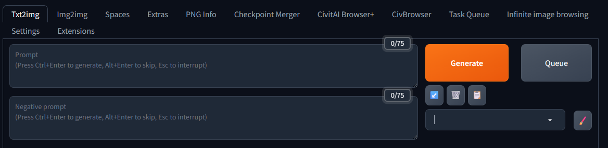
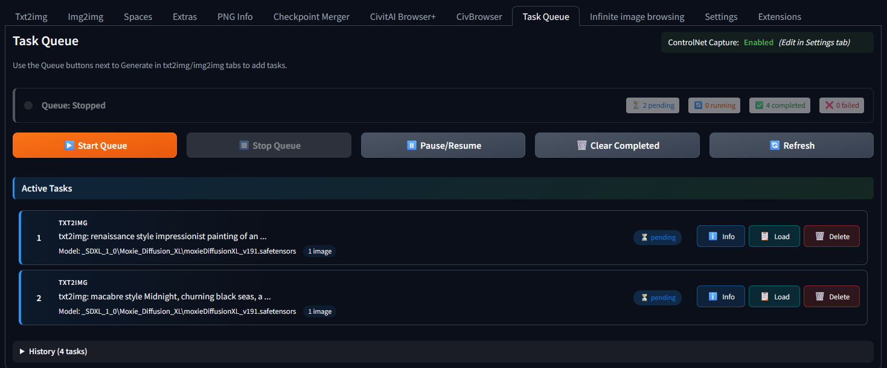
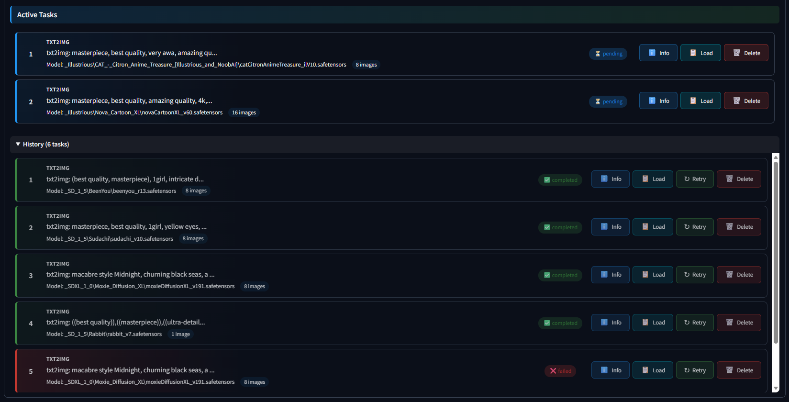
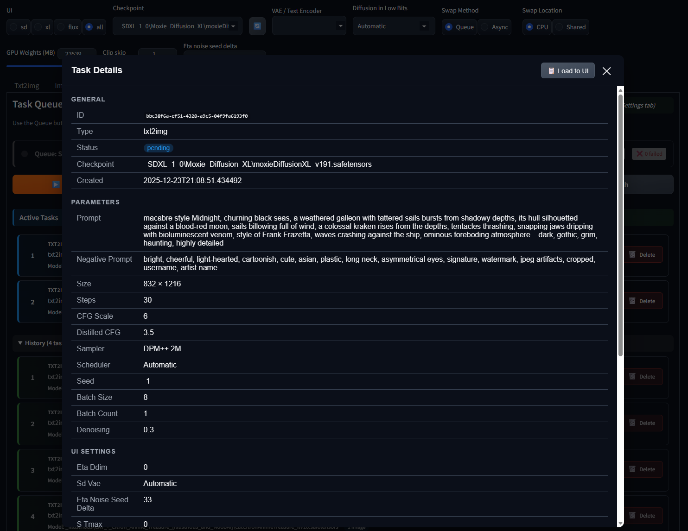
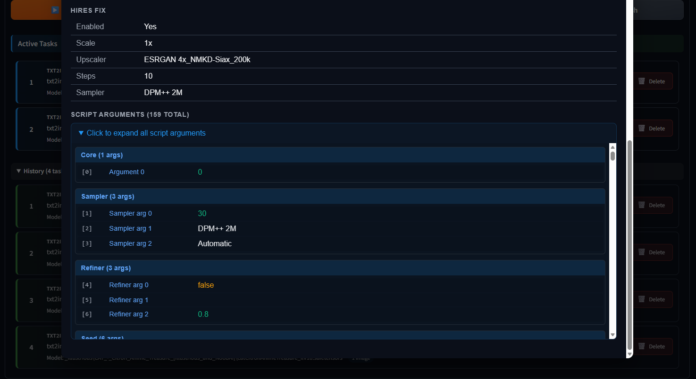

# SD WebUI Forge Task Scheduler

[](https://github.com/SachiraChin/sd-webui-forge-task-scheduler/actions/workflows/security-analysis.yml)
[](https://github.com/SachiraChin/sd-webui-forge-task-scheduler/actions/workflows/scorecard.yml)
[](https://opensource.org/licenses/MIT)

A task scheduling extension for Stable Diffusion WebUI Forge that allows you to queue generation tasks and process them sequentially.

---

## Disclaimer

This extension was developed with the assistance of [Claude](https://claude.ai).

I take full responsibility for any bugs, errors, or issues in the code. If you encounter problems, please report them and I'll do my best to address them. Bug reports, feature requests, and constructive feedback are all welcome.

---

## Credits & Acknowledgments

This extension wouldn't exist without the incredible work of other developers in the community. We studied, learned from, and were inspired by the following projects:

### [Agent Scheduler](https://github.com/SipherAGI/sd-webui-agent-scheduler) by SipherAGI
The original task scheduling extension that inspired this project. Their approach to queue management and task execution provided the foundational concepts for this extension.

### [SD Civitai Browser Plus](https://github.com/TheSlateGray/sd-civitai-browser-plus) by TheSlateGray
Their implementation of loading generation parameters back into the UI using the paste mechanism was invaluable. The "Load to UI" feature in this extension directly uses techniques learned from their codebase.

### [SD WebUI CivBrowser](https://github.com/SignalFlagZ/sd-webui-civbrowser) by SignalFlagZ
Another excellent Civitai browser extension that provided additional insights into WebUI integration patterns and UI/UX approaches.

**Thank you** to all these developers for sharing your work with the community. Open source thrives because of contributors like you.

---

## Why This Extension?

I created this extension because I encountered compatibility issues with existing task scheduler extensions when using **SD WebUI Forge**. Specifically:

- Some extensions didn't properly capture all generation parameters in Forge's modified architecture
- ControlNet and other extension parameters weren't being preserved correctly
- The existing solutions weren't designed with Forge's unique features in mind

This extension was built from the ground up with Forge compatibility as a primary goal, ensuring that:

- All generation parameters are captured correctly (including hires fix, samplers, schedulers)
- ControlNet units are properly serialized and restored (optional, can be enabled in settings)
- Extension parameters (ADetailer, etc.) are preserved through `extra_generation_params`
- The UI integrates seamlessly with Forge's interface

---

## Features

- **Queue Generation Tasks**: Add txt2img and img2img tasks to a queue instead of running them immediately
- **Background Processing**: Start the queue and let it process tasks while you do other things
- **Full Parameter Capture**: All generation settings are preserved, including:
  - Basic parameters (prompt, negative prompt, size, steps, CFG, seed)
  - Sampler and scheduler settings
  - Hires fix configuration
  - Model overrides (checkpoint, VAE, CLIP skip)
  - Extension parameters (ControlNet, ADetailer, etc.)
- **Load to UI**: Load any task's parameters back into the generation UI
- **Requeue Tasks**: Easily retry failed or completed tasks
- **Task History**: View completed, failed, and cancelled tasks in a collapsible history section
- **Responsive UI**: Buttons adapt to screen size (icon+text on wide screens, icons only on narrow)

---

## Installation

1. Open SD WebUI Forge
2. Go to **Extensions** tab
3. Go to **Install from URL**
4. Paste the repository URL: `https://github.com/YOUR_USERNAME/sd-webui-forge-task-scheduler`
5. Click **Install**
6. Restart the WebUI

Or manually clone into your extensions folder:

```bash
cd extensions
git clone https://github.com/YOUR_USERNAME/sd-webui-forge-task-scheduler
```

---

## How to Use

### Adding Tasks to the Queue



1. Set up your generation parameters as usual in the txt2img or img2img tab
2. Instead of clicking **Generate**, click the **Queue** button next to it
3. The task will be added to the queue with all current parameters saved

> **Note:** The Queue button works by triggering the Generate button, capturing all the generation data, and then stopping the generation process. When you click Queue for the first time, it may briefly look like the Generate process has started - this is normal. **Do not click Interrupt or Skip** during this time. Give it a few seconds to capture and save the data to the database.
>
> If you're unsure about the extension's behavior, try queuing a single image first and explore the Task Queue tab before queuing large batches.

### Managing the Queue



Navigate to the **Task Queue** tab to manage your queued tasks:

| Button | Description |
|--------|-------------|
| **Start Queue** | Begin processing pending tasks |
| **Stop Queue** | Stop processing (current task will complete) |
| **Pause/Resume** | Temporarily pause processing |
| **Clear History** | Remove completed/failed/cancelled tasks |

### Task List



Each task in the queue shows:
- Task number and type (txt2img/img2img)
- Prompt preview
- Model/checkpoint name
- Number of images to generate
- Status (pending, running, completed, failed, cancelled)

Available actions per task:
- **Info**: View full task details and parameters
- **Load**: Load task parameters back into the UI
- **Retry**: Requeue a completed/failed/cancelled task (creates a new task)
- **Delete**: Remove the task from the queue

### Task Details




Click the **Info** button on any task to see:
- All generation parameters
- Model overrides and UI settings
- Hires fix configuration (if enabled)
- Extension parameters
- Script arguments (expandable)
- Error messages (for failed tasks)
- Result image paths (for completed tasks)

### ControlNet Support


ControlNet parameter capture is **optional** and disabled by default (to avoid unnecessary overhead). To enable:

1. Go to **Settings** tab
2. Find **Task Scheduler** section
3. Enable **Capture ControlNet parameters**
4. Click **Apply settings**

When enabled, all ControlNet unit configurations will be saved with tasks and restored when using "Load to UI" or requeuing.

---

## Settings

| Setting | Description | Default |
|---------|-------------|---------|
| Capture ControlNet parameters | Save ControlNet configurations with tasks | Disabled |

---

## Tips

- **Batch efficiently**: Set up multiple variations and queue them all, then start the queue and walk away
- **Use Load to UI**: After a successful generation, you can load those exact parameters and tweak them for variations
- **Check the history**: Completed tasks remain in history so you can see what parameters produced which results

---

## Troubleshooting

### Queue button not appearing
- Make sure the extension is properly installed and enabled
- Restart the WebUI completely
- Check the console for any error messages

### Tasks failing immediately
- Check the task details (Info button) for error messages
- Ensure your model/checkpoint is still available
- Verify that all required extensions are installed

### ControlNet not loading
- Make sure "Capture ControlNet parameters" is enabled in settings
- The ControlNet extension must be installed and working
- Check that ControlNet images are accessible (they're stored as base64)

---

## License

This project is licensed under the MIT License - see the [LICENSE](LICENSE) file for details.

---

## Contributing

Contributions are welcome! Please feel free to submit issues and pull requests.

When reporting bugs, please include:
- SD WebUI Forge version
- Extension version
- Steps to reproduce
- Console error messages (if any)
